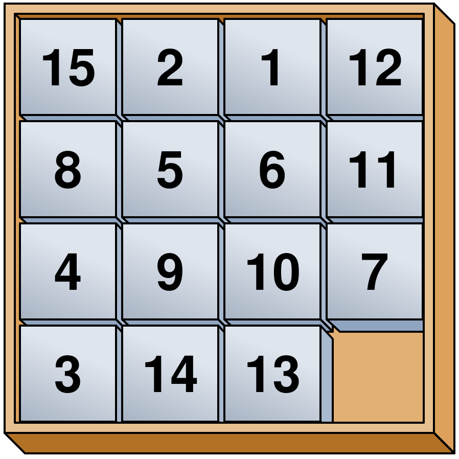
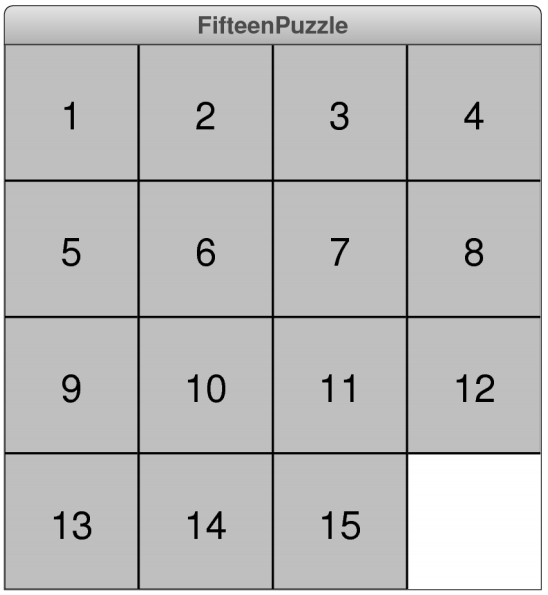

## Problem 1a: Tracing
- Trace the below function to determine its output

```mypython
def mystery(x, y=10):
  z = len(x)
  return puzzle(x, y) + puzzle(w[:enigma(z, 3)], y)

def enigma(x, w):
  return x - w ** 2

def puzzle(y, z):
  return y[z:]

w = "gingerbread man"
print(mystery(w, -3))
```

## Problem 1b: Tracing
- What is printed at the end?

```{.mypython style='max-height:850px; font-size:.75em;'}
class Frosty:
  def __init__(self, n, c):
    self.wild = [c]
    self.n = n

  def snowball(self, h=3):
    self.n -= h
    self.wild += [self.n]

  def cap(self):
    return self.wild

f = Frosty(8, 15)
f.snowball()
f.snowball(1)
A = f.cap()
A.append(1)
print(sum(f.cap()))
```

## Problem 2: Fundamentals
- The Racamán sequence starts at 0, termed $a_0$
- Future values in the sequence are given by:
  
  $$ a_n = \begin{cases} a_{n-1}-n, &\text{if $a_{n-1}-n > 0$ and has not already appeared in the sequence} \\ a_{n-1} + n, & \text{otherwise}\end{cases} $$
- Thus

  $$ \begin{aligned}
     a_0 &= 0\\
     a_1 &= 1\\
     a_2 &= 3\\
     a_3 &= 6\\
     a_4 &= 2\\
     a_5 &= 7\\
     \end{aligned} $$

## Problem 2 continued
- Write a function called `racaman(n)` which takes as an argument a single integer and returns the nth value of the Racamán sequence
  ```python-repl
  >>> print(racaman(3))
  6
  >>> print(racaman(6))
  13
  ```

## Problem 2 - Possible Solution
```{.mypython style='max-height:800px;'}
def racaman(n):
    if n == 0:
        return 0
    seq = [0] #a_0 starting case
    for i in range(1, n+1):
        potential = seq[i-1] - i
        if potential > 0 and potential not in seq:
            seq.append(potential)
        else:
            seq.append(seq[i-1] + i)
    return seq[-1]
```

## Problem 3: Interactive Graphics
::::::cols
::::col


::::

::::col
- The "Fifteen Puzzle" is a sliding puzzle with the numbers 1 through 15 on a set of square tiles
- One space in open, allowing neighboring tiles to be slid into the space
- Goal is to arrange the numbered tiles in order, from upper left to bottom right
::::
::::::


## Problem 3 - Step 1
::::::cols
::::col
- Write a program to display the starting state of the Fifteen Puzzle
- Each piece should be a `GCompound` containing a filled square and a centered number
- Should resemble the image to the right
::::

::::col

::::
::::::

## Problem 3 - Step 2
- Make the program interactive by having clicking on a piece move it to the open space if possible
  - Figure out which square you clicked on using `get_element_at`
  - Check all 4 directions to see if any are both inside the window and unoccupied. If those conditions are met, move the clicked piece into the free space. Otherwise, do nothing.


## Problem 3 - Possible Solution
```{.mypython style="max-height:900px; font-size:.75em;"}
from pgl import GWindow, GRect, GLabel, GCompound

SQUARE_SIZE = 60
GWINDOW_WIDTH = 4 * SQUARE_SIZE
GWINDOW_HEIGHT = 4 * SQUARE_SIZE
SQUARE_FILL_COLOR = "LightGray"
PUZZLE_FONT = "18px 'Sans-Serif'"

def create_piece(num):
    compound = GCompound()
    square = GRect(SQUARE_SIZE, SQUARE_SIZE)
    square.set_filled(True)
    square.set_fill_color(SQUARE_FILL_COLOR)
    value = GLabel(str(num))
    value.set_font(PUZZLE_FONT)
    value.move(
        SQUARE_SIZE / 2 - value.get_width() / 2,
        SQUARE_SIZE / 2 + value.get_ascent() / 2,
    )
    compound.add(square)
    compound.add(value)
    return compound

def click_action(e):
    mx, my = e.get_x(), e.get_y()
    current = gw.get_element_at(mx, my)
    if current is not None: #we clicked on a piece
        # Search all 4 directions
        for x, y in [(-1, 0), (1, 0), (0, -1), (0, 1)]:
            cx = mx + x * SQUARE_SIZE
            cy = my + y * SQUARE_SIZE
            if ((0 < cx < GWINDOW_WIDTH) and 
                (0 < cy < GWINDOW_HEIGHT)):
                elem = gw.get_element_at(cx, cy)
                if elem is None: # the empty space!
                    current.move(x * SQUARE_SIZE, 
                                 y * SQUARE_SIZE)
                    return #stops the search early if we found it

gw = GWindow(GWINDOW_WIDTH, GWINDOW_HEIGHT)
for i in range(15):
    p = create_piece(i + 1)
    p.move(SQUARE_SIZE * (i % 4), 
           SQUARE_SIZE * (i // 4))
    gw.add(p)
gw.add_event_listener("click", click_action)
```


## Problem 4: Strings and Files
::::::cols
::::col
- Suppose you have a data file similar to the one to the right
- Your task is to determine the first number that appears on a line and the last number that appears on a line, where a "number" consists of any number of consecutive digits
- The last number should be subtracted from the first, and you want to compute the total sum of this difference over all the lines of the file
::::

::::col

```{.text .file name=data.txt}
baot234'yn8bas92*b
s2ba#9don71abis012
,fygx*@qnadb543nas
```
- Write a function `process_file(filename)` that will return this sum for any given file.
::::
::::::

## Problem 4 - Possible Solution
```{.mypython}

```


## Problem 5: Defining Classes
- You want to create a class that will then produce numbered labels for you on demand
- Requirements:
  - The constructor should take two arguments: a string indicating the desired prefix for the labels and an optional starting index for the sequence number, which defaults to 1.
  - A `next_label` method that returns a string corresponding to the next numbered label in the sequence

## Problem 5 - Testing
- You should be able to replicate:
```{.python-repl style='font-size: .8em; max-height: 800px'}
>>> figures = LabelGenerator("Figure ")
>>> figures.next_label()
Figure 1
>>> figures.next_label()
Figure 2
>>> figures.next_label()
Figure 3
>>> figures = LabelGenerator("P", 0)
>>> figures.next_label()
P0
>>> figures.next_label()
P1
```


## Problem 6: Working with Data Structures
::::::cols
::::col
- "Hunt the Wumpus" involves a player character and the fearsome Wumpus moving through a network of connected rooms, a small portion of which is shown to the right
- A Wumpus is very smelly, and a player can smell the Wumpus from two rooms away
- Player and Wumpus location, as well as the rooms connectivity, is stored in a compound data structure, shown on the next page
::::

::::col
\begin{tikzpicture}%%width=100%
[room/.style = {draw, white, very thick, circle, minimum size=1cm, label={[label distance=-4.5mm, white]90:{\scriptsize #1}}}, font=\bf]
\node[room=2] (2) at (0,0) {P};
\node[room=3] (3) at ($(2)+(0:2)$) {};
\node[room=7] (7) at ($(2)+(120:2)$) {};
\node[room=18] (18) at ($(2)+(240:2)$) {};
\node[room=12] (12) at ($(7)+(60:2)$) {};
\node[room=19] (19) at ($(7)+(180:2)$) {W};
\node[room=20] (20) at ($(3)+(60:2)$) {};
\node[room=16] (16) at ($(3)+(-60:2)$) {};
\node[room=4 ] (4) at ($(18)+(180:2)$) {};
\node[room=11] (11) at ($(18)+(-60:2)$) {};

\path[ultra thick, white]
    (2) edge (7) edge (3) edge (18)
    (7) edge (19) edge (12)
    (3) edge (20) edge (16)
    (18) edge (4) edge (11);
\end{tikzpicture}


::::
::::::

## Problem 6 - Data Structure
```{.mypython style='max-height:900px; font-size:.75em'}
cave = {
    "player": 2,
    "wumpus": 19,
    "connections": [
        None,			# Room  0 is not used
        [6, 14, 16],	# Room  1 connects to 6, 14, and 16
        [3,  7, 18],	# Room  2 connects to 3,  7, and 18
        [2, 16, 20],	# Room  3 connects to 2, 16, and 20
        [6, 18, 19],	# Room  4 connects to 6, 18, and 19
        [8,  9, 11],	# Room  5 connects to 8,  9, and 11
        [1,  4, 15],	# Room  6 connects to 1,  4, and 15
        [2, 12, 19],	# Room  7 connects to 2, 12, and 19
        [5, 10, 13],	# Room  8 connects to 5, 10, and 13
        [5, 11, 17],	# Room  9 connects to 5, 11, and 17
        [8, 14, 16],	# Room 10 connects to 8, 14, and 16
        [5,  9, 18],	# Room 11 connects to 5,  9, and 18
        [7, 14, 15],	# Room 12 connects to 7, 14, and 15
        [8, 15, 20],	# Room 13 connects to 8, 15, and 20
        [1, 10, 12],	# Room 14 connects to 1, 10, and 12
        [6, 12, 13],	# Room 15 connects to 6, 12, and 13
        [1,  3, 10],	# Room 16 connects to 1,  3, and 10
        [9, 19, 20],	# Room 17 connects to 9, 19, and 20
        [2,  4, 11],	# Room 18 connects to 2,  4, and 11
        [4,  7, 17],	# Room 19 connects to 4,  7, and 17
        [3, 13, 17],	# Room 20 connects to 3, 13, and 17
    ]
}
```

## Problem 6 - Your Task
- Write a predicate function called `player_smells_a_wumpus(world_data)` which takes in a dictionary describing the world data (`cave` in the previous page example).
  - Your function should return `True` if the player can smell the wumpus (is 2 or less rooms away) or `False` otherwise
